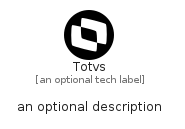

# Totvs


```text
simpleicons-14/T/Totvs
```

```text
include('simpleicons-14/T/Totvs')
```


| Illustration | Totvs |
| :---: | :---: |
|  |  |


## Sprites
The item provides the following sriptes:

- `<$TotvsXs>`
- `<$TotvsSm>`
- `<$TotvsMd>`
- `<$TotvsLg>`


## Totvs

### Load remotely
```plantuml
@startuml
' configures the library
!global $LIB_BASE_LOCATION="https://raw.githubusercontent.com/tmorin/plantuml-libs/master/distribution"

' loads the library's bootstrap
!include $LIB_BASE_LOCATION/bootstrap.puml

' loads the package bootstrap
include('simpleicons-14/bootstrap')

' loads the Item which embeds the element Totvs
include('simpleicons-14/T/Totvs')

' renders the element
Totvs('Totvs', 'Totvs', 'an optional tech label', 'an optional description')
@enduml
```

### Load locally
```plantuml
@startuml
' configures the library
!global $INCLUSION_MODE="local"
!global $LIB_BASE_LOCATION="../.."

' loads the library's bootstrap
!include $LIB_BASE_LOCATION/bootstrap.puml

' loads the package bootstrap
include('simpleicons-14/bootstrap')

' loads the Item which embeds the element Totvs
include('simpleicons-14/T/Totvs')

' renders the element
Totvs('Totvs', 'Totvs', 'an optional tech label', 'an optional description')
@enduml
```

