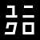
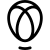

# U

The module contains 52 items.

| |Name|
|:---:|---|
|  | [simpleicons-14/U/Uber](../../simpleicons-14/U/Uber.md) |
|  | [simpleicons-14/U/Ubereats](../../simpleicons-14/U/Ubereats.md) |
|  | [simpleicons-14/U/Ubiquiti](../../simpleicons-14/U/Ubiquiti.md) |
|  | [simpleicons-14/U/Ubisoft](../../simpleicons-14/U/Ubisoft.md) |
|  | [simpleicons-14/U/Ublockorigin](../../simpleicons-14/U/Ublockorigin.md) |
|  | [simpleicons-14/U/Ubuntu](../../simpleicons-14/U/Ubuntu.md) |
|  | [simpleicons-14/U/Ubuntumate](../../simpleicons-14/U/Ubuntumate.md) |
|  | [simpleicons-14/U/Udacity](../../simpleicons-14/U/Udacity.md) |
|  | [simpleicons-14/U/Udemy](../../simpleicons-14/U/Udemy.md) |
|  | [simpleicons-14/U/Udotsdotnews](../../simpleicons-14/U/Udotsdotnews.md) |
|  | [simpleicons-14/U/Ufc](../../simpleicons-14/U/Ufc.md) |
|  | [simpleicons-14/U/Uikit](../../simpleicons-14/U/Uikit.md) |
|  | [simpleicons-14/U/Uipath](../../simpleicons-14/U/Uipath.md) |
|  | [simpleicons-14/U/Ukca](../../simpleicons-14/U/Ukca.md) |
|  | [simpleicons-14/U/Ultralytics](../../simpleicons-14/U/Ultralytics.md) |
|  | [simpleicons-14/U/Ulule](../../simpleicons-14/U/Ulule.md) |
|  | [simpleicons-14/U/Umami](../../simpleicons-14/U/Umami.md) |
|  | [simpleicons-14/U/Umbraco](../../simpleicons-14/U/Umbraco.md) |
|  | [simpleicons-14/U/Umbrel](../../simpleicons-14/U/Umbrel.md) |
|  | [simpleicons-14/U/Uml](../../simpleicons-14/U/Uml.md) |
|  | [simpleicons-14/U/Unacademy](../../simpleicons-14/U/Unacademy.md) |
|  | [simpleicons-14/U/Underarmour](../../simpleicons-14/U/Underarmour.md) |
|  | [simpleicons-14/U/Underscoredotjs](../../simpleicons-14/U/Underscoredotjs.md) |
|  | [simpleicons-14/U/Undertale](../../simpleicons-14/U/Undertale.md) |
|  | [simpleicons-14/U/Unicode](../../simpleicons-14/U/Unicode.md) |
|  | [simpleicons-14/U/Unilever](../../simpleicons-14/U/Unilever.md) |
|  | [simpleicons-14/U/Uniqlo](../../simpleicons-14/U/Uniqlo.md) |
|  | [simpleicons-14/U/UniqloJa](../../simpleicons-14/U/UniqloJa.md) |
|  | [simpleicons-14/U/Unitedairlines](../../simpleicons-14/U/Unitedairlines.md) |
|  | [simpleicons-14/U/Unitednations](../../simpleicons-14/U/Unitednations.md) |
|  | [simpleicons-14/U/Unity](../../simpleicons-14/U/Unity.md) |
|  | [simpleicons-14/U/Unjs](../../simpleicons-14/U/Unjs.md) |
|  | [simpleicons-14/U/Unlicense](../../simpleicons-14/U/Unlicense.md) |
|  | [simpleicons-14/U/Unocss](../../simpleicons-14/U/Unocss.md) |
|  | [simpleicons-14/U/Unpkg](../../simpleicons-14/U/Unpkg.md) |
|  | [simpleicons-14/U/Unraid](../../simpleicons-14/U/Unraid.md) |
|  | [simpleicons-14/U/Unrealengine](../../simpleicons-14/U/Unrealengine.md) |
|  | [simpleicons-14/U/Unsplash](../../simpleicons-14/U/Unsplash.md) |
|  | [simpleicons-14/U/Unstop](../../simpleicons-14/U/Unstop.md) |
|  | [simpleicons-14/U/Untappd](../../simpleicons-14/U/Untappd.md) |
|  | [simpleicons-14/U/Upcloud](../../simpleicons-14/U/Upcloud.md) |
|  | [simpleicons-14/U/Uphold](../../simpleicons-14/U/Uphold.md) |
|  | [simpleicons-14/U/Uplabs](../../simpleicons-14/U/Uplabs.md) |
|  | [simpleicons-14/U/Upptime](../../simpleicons-14/U/Upptime.md) |
|  | [simpleicons-14/U/Ups](../../simpleicons-14/U/Ups.md) |
|  | [simpleicons-14/U/Upstash](../../simpleicons-14/U/Upstash.md) |
|  | [simpleicons-14/U/Uptimekuma](../../simpleicons-14/U/Uptimekuma.md) |
|  | [simpleicons-14/U/Upwork](../../simpleicons-14/U/Upwork.md) |
|  | [simpleicons-14/U/Uservoice](../../simpleicons-14/U/Uservoice.md) |
|  | [simpleicons-14/U/Usps](../../simpleicons-14/U/Usps.md) |
|  | [simpleicons-14/U/Utorrent](../../simpleicons-14/U/Utorrent.md) |
|  | [simpleicons-14/U/Uv](../../simpleicons-14/U/Uv.md) |

