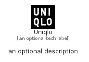

# Uniqlo


```text
simpleicons-14/U/Uniqlo
```

```text
include('simpleicons-14/U/Uniqlo')
```


| Illustration | Uniqlo |
| :---: | :---: |
|  |  |


## Sprites
The item provides the following sriptes:

- `<$UniqloXs>`
- `<$UniqloSm>`
- `<$UniqloMd>`
- `<$UniqloLg>`


## Uniqlo

### Load remotely
```plantuml
@startuml
' configures the library
!global $LIB_BASE_LOCATION="https://raw.githubusercontent.com/tmorin/plantuml-libs/master/distribution"

' loads the library's bootstrap
!include $LIB_BASE_LOCATION/bootstrap.puml

' loads the package bootstrap
include('simpleicons-14/bootstrap')

' loads the Item which embeds the element Uniqlo
include('simpleicons-14/U/Uniqlo')

' renders the element
Uniqlo('Uniqlo', 'Uniqlo', 'an optional tech label', 'an optional description')
@enduml
```

### Load locally
```plantuml
@startuml
' configures the library
!global $INCLUSION_MODE="local"
!global $LIB_BASE_LOCATION="../.."

' loads the library's bootstrap
!include $LIB_BASE_LOCATION/bootstrap.puml

' loads the package bootstrap
include('simpleicons-14/bootstrap')

' loads the Item which embeds the element Uniqlo
include('simpleicons-14/U/Uniqlo')

' renders the element
Uniqlo('Uniqlo', 'Uniqlo', 'an optional tech label', 'an optional description')
@enduml
```

