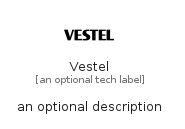

# Vestel


```text
simpleicons-14/V/Vestel
```

```text
include('simpleicons-14/V/Vestel')
```


| Illustration | Vestel |
| :---: | :---: |
|  |  |


## Sprites
The item provides the following sriptes:

- `<$VestelXs>`
- `<$VestelSm>`
- `<$VestelMd>`
- `<$VestelLg>`


## Vestel

### Load remotely
```plantuml
@startuml
' configures the library
!global $LIB_BASE_LOCATION="https://raw.githubusercontent.com/tmorin/plantuml-libs/master/distribution"

' loads the library's bootstrap
!include $LIB_BASE_LOCATION/bootstrap.puml

' loads the package bootstrap
include('simpleicons-14/bootstrap')

' loads the Item which embeds the element Vestel
include('simpleicons-14/V/Vestel')

' renders the element
Vestel('Vestel', 'Vestel', 'an optional tech label', 'an optional description')
@enduml
```

### Load locally
```plantuml
@startuml
' configures the library
!global $INCLUSION_MODE="local"
!global $LIB_BASE_LOCATION="../.."

' loads the library's bootstrap
!include $LIB_BASE_LOCATION/bootstrap.puml

' loads the package bootstrap
include('simpleicons-14/bootstrap')

' loads the Item which embeds the element Vestel
include('simpleicons-14/V/Vestel')

' renders the element
Vestel('Vestel', 'Vestel', 'an optional tech label', 'an optional description')
@enduml
```

