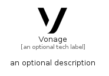

# Vonage


```text
simpleicons-14/V/Vonage
```

```text
include('simpleicons-14/V/Vonage')
```


| Illustration | Vonage |
| :---: | :---: |
|  |  |


## Sprites
The item provides the following sriptes:

- `<$VonageXs>`
- `<$VonageSm>`
- `<$VonageMd>`
- `<$VonageLg>`


## Vonage

### Load remotely
```plantuml
@startuml
' configures the library
!global $LIB_BASE_LOCATION="https://raw.githubusercontent.com/tmorin/plantuml-libs/master/distribution"

' loads the library's bootstrap
!include $LIB_BASE_LOCATION/bootstrap.puml

' loads the package bootstrap
include('simpleicons-14/bootstrap')

' loads the Item which embeds the element Vonage
include('simpleicons-14/V/Vonage')

' renders the element
Vonage('Vonage', 'Vonage', 'an optional tech label', 'an optional description')
@enduml
```

### Load locally
```plantuml
@startuml
' configures the library
!global $INCLUSION_MODE="local"
!global $LIB_BASE_LOCATION="../.."

' loads the library's bootstrap
!include $LIB_BASE_LOCATION/bootstrap.puml

' loads the package bootstrap
include('simpleicons-14/bootstrap')

' loads the Item which embeds the element Vonage
include('simpleicons-14/V/Vonage')

' renders the element
Vonage('Vonage', 'Vonage', 'an optional tech label', 'an optional description')
@enduml
```

