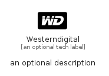

# Westerndigital


```text
simpleicons-14/W/Westerndigital
```

```text
include('simpleicons-14/W/Westerndigital')
```


| Illustration | Westerndigital |
| :---: | :---: |
|  |  |


## Sprites
The item provides the following sriptes:

- `<$WesterndigitalXs>`
- `<$WesterndigitalSm>`
- `<$WesterndigitalMd>`
- `<$WesterndigitalLg>`


## Westerndigital

### Load remotely
```plantuml
@startuml
' configures the library
!global $LIB_BASE_LOCATION="https://raw.githubusercontent.com/tmorin/plantuml-libs/master/distribution"

' loads the library's bootstrap
!include $LIB_BASE_LOCATION/bootstrap.puml

' loads the package bootstrap
include('simpleicons-14/bootstrap')

' loads the Item which embeds the element Westerndigital
include('simpleicons-14/W/Westerndigital')

' renders the element
Westerndigital('Westerndigital', 'Westerndigital', 'an optional tech label', 'an optional description')
@enduml
```

### Load locally
```plantuml
@startuml
' configures the library
!global $INCLUSION_MODE="local"
!global $LIB_BASE_LOCATION="../.."

' loads the library's bootstrap
!include $LIB_BASE_LOCATION/bootstrap.puml

' loads the package bootstrap
include('simpleicons-14/bootstrap')

' loads the Item which embeds the element Westerndigital
include('simpleicons-14/W/Westerndigital')

' renders the element
Westerndigital('Westerndigital', 'Westerndigital', 'an optional tech label', 'an optional description')
@enduml
```

