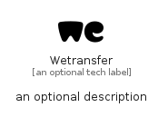

# Wetransfer


```text
simpleicons-14/W/Wetransfer
```

```text
include('simpleicons-14/W/Wetransfer')
```


| Illustration | Wetransfer |
| :---: | :---: |
|  |  |


## Sprites
The item provides the following sriptes:

- `<$WetransferXs>`
- `<$WetransferSm>`
- `<$WetransferMd>`
- `<$WetransferLg>`


## Wetransfer

### Load remotely
```plantuml
@startuml
' configures the library
!global $LIB_BASE_LOCATION="https://raw.githubusercontent.com/tmorin/plantuml-libs/master/distribution"

' loads the library's bootstrap
!include $LIB_BASE_LOCATION/bootstrap.puml

' loads the package bootstrap
include('simpleicons-14/bootstrap')

' loads the Item which embeds the element Wetransfer
include('simpleicons-14/W/Wetransfer')

' renders the element
Wetransfer('Wetransfer', 'Wetransfer', 'an optional tech label', 'an optional description')
@enduml
```

### Load locally
```plantuml
@startuml
' configures the library
!global $INCLUSION_MODE="local"
!global $LIB_BASE_LOCATION="../.."

' loads the library's bootstrap
!include $LIB_BASE_LOCATION/bootstrap.puml

' loads the package bootstrap
include('simpleicons-14/bootstrap')

' loads the Item which embeds the element Wetransfer
include('simpleicons-14/W/Wetransfer')

' renders the element
Wetransfer('Wetransfer', 'Wetransfer', 'an optional tech label', 'an optional description')
@enduml
```

