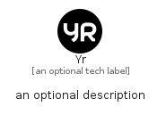

# Yr


```text
simpleicons-14/Y/Yr
```

```text
include('simpleicons-14/Y/Yr')
```


| Illustration | Yr |
| :---: | :---: |
|  |  |


## Sprites
The item provides the following sriptes:

- `<$YrXs>`
- `<$YrSm>`
- `<$YrMd>`
- `<$YrLg>`


## Yr

### Load remotely
```plantuml
@startuml
' configures the library
!global $LIB_BASE_LOCATION="https://raw.githubusercontent.com/tmorin/plantuml-libs/master/distribution"

' loads the library's bootstrap
!include $LIB_BASE_LOCATION/bootstrap.puml

' loads the package bootstrap
include('simpleicons-14/bootstrap')

' loads the Item which embeds the element Yr
include('simpleicons-14/Y/Yr')

' renders the element
Yr('Yr', 'Yr', 'an optional tech label', 'an optional description')
@enduml
```

### Load locally
```plantuml
@startuml
' configures the library
!global $INCLUSION_MODE="local"
!global $LIB_BASE_LOCATION="../.."

' loads the library's bootstrap
!include $LIB_BASE_LOCATION/bootstrap.puml

' loads the package bootstrap
include('simpleicons-14/bootstrap')

' loads the Item which embeds the element Yr
include('simpleicons-14/Y/Yr')

' renders the element
Yr('Yr', 'Yr', 'an optional tech label', 'an optional description')
@enduml
```

