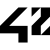
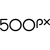

# _

The module contains 7 items.

| |Name|
|:---:|---|
|  | [simpleicons-14/_/_1001Tracklists](../../simpleicons-14/_/_1001Tracklists.md) |
|  | [simpleicons-14/_/_1Password](../../simpleicons-14/_/_1Password.md) |
|  | [simpleicons-14/_/_3M](../../simpleicons-14/_/_3M.md) |
|  | [simpleicons-14/_/_42](../../simpleicons-14/_/_42.md) |
|  | [simpleicons-14/_/_4Chan](../../simpleicons-14/_/_4Chan.md) |
|  | [simpleicons-14/_/_4D](../../simpleicons-14/_/_4D.md) |
|  | [simpleicons-14/_/_500Px](../../simpleicons-14/_/_500Px.md) |

