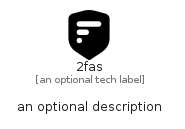

# _2Fas


```text
simpleicons-14/_/_2Fas
```

```text
include('simpleicons-14/_/_2Fas')
```


| Illustration | _2Fas |
| :---: | :---: |
|  |  |


## Sprites
The item provides the following sriptes:

- `<$_2FasXs>`
- `<$_2FasSm>`
- `<$_2FasMd>`
- `<$_2FasLg>`


## _2Fas

### Load remotely
```plantuml
@startuml
' configures the library
!global $LIB_BASE_LOCATION="https://raw.githubusercontent.com/tmorin/plantuml-libs/master/distribution"

' loads the library's bootstrap
!include $LIB_BASE_LOCATION/bootstrap.puml

' loads the package bootstrap
include('simpleicons-14/bootstrap')

' loads the Item which embeds the element _2Fas
include('simpleicons-14/_/_2Fas')

' renders the element
_2Fas('2fas', '2fas', 'an optional tech label', 'an optional description')
@enduml
```

### Load locally
```plantuml
@startuml
' configures the library
!global $INCLUSION_MODE="local"
!global $LIB_BASE_LOCATION="../.."

' loads the library's bootstrap
!include $LIB_BASE_LOCATION/bootstrap.puml

' loads the package bootstrap
include('simpleicons-14/bootstrap')

' loads the Item which embeds the element _2Fas
include('simpleicons-14/_/_2Fas')

' renders the element
_2Fas('2fas', '2fas', 'an optional tech label', 'an optional description')
@enduml
```

