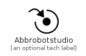

# Abbrobotstudio


```text
simpleicons-5/A/Abbrobotstudio
```

```text
include('simpleicons-5/A/Abbrobotstudio')
```


| Illustration | Abbrobotstudio |
| :---: | :---: |
|  |  |


## Abbrobotstudio

### Load remotely
```plantuml
@startuml
' configures the library
!global $LIB_BASE_LOCATION="https://github.com/tmorin/plantuml-libs/distribution"

' loads the library's bootstrap
!include $LIB_BASE_LOCATION/bootstrap.puml

' loads the package bootstrap
include('simpleicons-5/bootstrap')

' loads the Item which embeds the element Abbrobotstudio
include('simpleicons-5/A/Abbrobotstudio')

' renders the element
Abbrobotstudio('Abbrobotstudio', 'Abbrobotstudio', 'an optional tech label')
@enduml
```

### Load locally
```plantuml
@startuml
' configures the library
!global $INCLUSION_MODE="local"
!global $LIB_BASE_LOCATION="../.."

' loads the library's bootstrap
!include $LIB_BASE_LOCATION/bootstrap.puml

' loads the package bootstrap
include('simpleicons-5/bootstrap')

' loads the Item which embeds the element Abbrobotstudio
include('simpleicons-5/A/Abbrobotstudio')

' renders the element
Abbrobotstudio('Abbrobotstudio', 'Abbrobotstudio', 'an optional tech label')
@enduml
```

