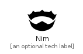

# Nim


```text
simpleicons-5/N/Nim
```

```text
include('simpleicons-5/N/Nim')
```


| Illustration | Nim |
| :---: | :---: |
|  |  |


## Nim

### Load remotely
```plantuml
@startuml
' configures the library
!global $LIB_BASE_LOCATION="https://github.com/tmorin/plantuml-libs/distribution"

' loads the library's bootstrap
!include $LIB_BASE_LOCATION/bootstrap.puml

' loads the package bootstrap
include('simpleicons-5/bootstrap')

' loads the Item which embeds the element Nim
include('simpleicons-5/N/Nim')

' renders the element
Nim('Nim', 'Nim', 'an optional tech label')
@enduml
```

### Load locally
```plantuml
@startuml
' configures the library
!global $INCLUSION_MODE="local"
!global $LIB_BASE_LOCATION="../.."

' loads the library's bootstrap
!include $LIB_BASE_LOCATION/bootstrap.puml

' loads the package bootstrap
include('simpleicons-5/bootstrap')

' loads the Item which embeds the element Nim
include('simpleicons-5/N/Nim')

' renders the element
Nim('Nim', 'Nim', 'an optional tech label')
@enduml
```

