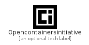

# Opencontainersinitiative


```text
simpleicons-5/O/Opencontainersinitiative
```

```text
include('simpleicons-5/O/Opencontainersinitiative')
```


| Illustration | Opencontainersinitiative |
| :---: | :---: |
|  |  |


## Opencontainersinitiative

### Load remotely
```plantuml
@startuml
' configures the library
!global $LIB_BASE_LOCATION="https://github.com/tmorin/plantuml-libs/distribution"

' loads the library's bootstrap
!include $LIB_BASE_LOCATION/bootstrap.puml

' loads the package bootstrap
include('simpleicons-5/bootstrap')

' loads the Item which embeds the element Opencontainersinitiative
include('simpleicons-5/O/Opencontainersinitiative')

' renders the element
Opencontainersinitiative('Opencontainersinitiative', 'Opencontainersinitiative', 'an optional tech label')
@enduml
```

### Load locally
```plantuml
@startuml
' configures the library
!global $INCLUSION_MODE="local"
!global $LIB_BASE_LOCATION="../.."

' loads the library's bootstrap
!include $LIB_BASE_LOCATION/bootstrap.puml

' loads the package bootstrap
include('simpleicons-5/bootstrap')

' loads the Item which embeds the element Opencontainersinitiative
include('simpleicons-5/O/Opencontainersinitiative')

' renders the element
Opencontainersinitiative('Opencontainersinitiative', 'Opencontainersinitiative', 'an optional tech label')
@enduml
```

