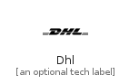

# Dhl


```text
simpleicons-6/D/Dhl
```

```text
include('simpleicons-6/D/Dhl')
```


| Illustration | Dhl |
| :---: | :---: |
|  |  |


## Dhl

### Load remotely
```plantuml
@startuml
' configures the library
!global $LIB_BASE_LOCATION="https://raw.githubusercontent.com/tmorin/plantuml-libs/master/distribution"

' loads the library's bootstrap
!include $LIB_BASE_LOCATION/bootstrap.puml

' loads the package bootstrap
include('simpleicons-6/bootstrap')

' loads the Item which embeds the element Dhl
include('simpleicons-6/D/Dhl')

' renders the element
Dhl('Dhl', 'Dhl', 'an optional tech label')
@enduml
```

### Load locally
```plantuml
@startuml
' configures the library
!global $INCLUSION_MODE="local"
!global $LIB_BASE_LOCATION="../.."

' loads the library's bootstrap
!include $LIB_BASE_LOCATION/bootstrap.puml

' loads the package bootstrap
include('simpleicons-6/bootstrap')

' loads the Item which embeds the element Dhl
include('simpleicons-6/D/Dhl')

' renders the element
Dhl('Dhl', 'Dhl', 'an optional tech label')
@enduml
```

