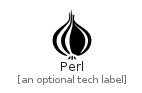

# Perl


```text
simpleicons-6/P/Perl
```

```text
include('simpleicons-6/P/Perl')
```


| Illustration | Perl |
| :---: | :---: |
|  |  |


## Perl

### Load remotely
```plantuml
@startuml
' configures the library
!global $LIB_BASE_LOCATION="https://raw.githubusercontent.com/tmorin/plantuml-libs/master/distribution"

' loads the library's bootstrap
!include $LIB_BASE_LOCATION/bootstrap.puml

' loads the package bootstrap
include('simpleicons-6/bootstrap')

' loads the Item which embeds the element Perl
include('simpleicons-6/P/Perl')

' renders the element
Perl('Perl', 'Perl', 'an optional tech label')
@enduml
```

### Load locally
```plantuml
@startuml
' configures the library
!global $INCLUSION_MODE="local"
!global $LIB_BASE_LOCATION="../.."

' loads the library's bootstrap
!include $LIB_BASE_LOCATION/bootstrap.puml

' loads the package bootstrap
include('simpleicons-6/bootstrap')

' loads the Item which embeds the element Perl
include('simpleicons-6/P/Perl')

' renders the element
Perl('Perl', 'Perl', 'an optional tech label')
@enduml
```

