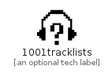

# _1001Tracklists


```text
simpleicons-6/_/_1001Tracklists
```

```text
include('simpleicons-6/_/_1001Tracklists')
```


| Illustration | _1001Tracklists |
| :---: | :---: |
|  |  |


## _1001Tracklists

### Load remotely
```plantuml
@startuml
' configures the library
!global $LIB_BASE_LOCATION="https://raw.githubusercontent.com/tmorin/plantuml-libs/master/distribution"

' loads the library's bootstrap
!include $LIB_BASE_LOCATION/bootstrap.puml

' loads the package bootstrap
include('simpleicons-6/bootstrap')

' loads the Item which embeds the element _1001Tracklists
include('simpleicons-6/_/_1001Tracklists')

' renders the element
_1001Tracklists('1001tracklists', '1001tracklists', 'an optional tech label')
@enduml
```

### Load locally
```plantuml
@startuml
' configures the library
!global $INCLUSION_MODE="local"
!global $LIB_BASE_LOCATION="../.."

' loads the library's bootstrap
!include $LIB_BASE_LOCATION/bootstrap.puml

' loads the package bootstrap
include('simpleicons-6/bootstrap')

' loads the Item which embeds the element _1001Tracklists
include('simpleicons-6/_/_1001Tracklists')

' renders the element
_1001Tracklists('1001tracklists', '1001tracklists', 'an optional tech label')
@enduml
```

