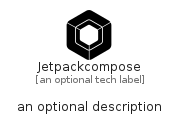

# Jetpackcompose


```text
simpleicons-7/J/Jetpackcompose
```

```text
include('simpleicons-7/J/Jetpackcompose')
```


| Illustration | Jetpackcompose |
| :---: | :---: |
|  |  |


## Jetpackcompose

### Load remotely
```plantuml
@startuml
' configures the library
!global $LIB_BASE_LOCATION="https://raw.githubusercontent.com/tmorin/plantuml-libs/master/distribution"

' loads the library's bootstrap
!include $LIB_BASE_LOCATION/bootstrap.puml

' loads the package bootstrap
include('simpleicons-7/bootstrap')

' loads the Item which embeds the element Jetpackcompose
include('simpleicons-7/J/Jetpackcompose')

' renders the element
Jetpackcompose('Jetpackcompose', 'Jetpackcompose', 'an optional tech label', 'an optional description')
@enduml
```

### Load locally
```plantuml
@startuml
' configures the library
!global $INCLUSION_MODE="local"
!global $LIB_BASE_LOCATION="../.."

' loads the library's bootstrap
!include $LIB_BASE_LOCATION/bootstrap.puml

' loads the package bootstrap
include('simpleicons-7/bootstrap')

' loads the Item which embeds the element Jetpackcompose
include('simpleicons-7/J/Jetpackcompose')

' renders the element
Jetpackcompose('Jetpackcompose', 'Jetpackcompose', 'an optional tech label', 'an optional description')
@enduml
```

