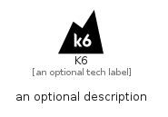

# K6


```text
simpleicons-7/K/K6
```

```text
include('simpleicons-7/K/K6')
```


| Illustration | K6 |
| :---: | :---: |
|  |  |


## K6

### Load remotely
```plantuml
@startuml
' configures the library
!global $LIB_BASE_LOCATION="https://raw.githubusercontent.com/tmorin/plantuml-libs/master/distribution"

' loads the library's bootstrap
!include $LIB_BASE_LOCATION/bootstrap.puml

' loads the package bootstrap
include('simpleicons-7/bootstrap')

' loads the Item which embeds the element K6
include('simpleicons-7/K/K6')

' renders the element
K6('K6', 'K6', 'an optional tech label')
@enduml
```

### Load locally
```plantuml
@startuml
' configures the library
!global $INCLUSION_MODE="local"
!global $LIB_BASE_LOCATION="../.."

' loads the library's bootstrap
!include $LIB_BASE_LOCATION/bootstrap.puml

' loads the package bootstrap
include('simpleicons-7/bootstrap')

' loads the Item which embeds the element K6
include('simpleicons-7/K/K6')

' renders the element
K6('K6', 'K6', 'an optional tech label')
@enduml
```

