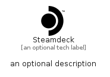

# Steamdeck


```text
simpleicons-7/S/Steamdeck
```

```text
include('simpleicons-7/S/Steamdeck')
```


| Illustration | Steamdeck |
| :---: | :---: |
|  |  |


## Steamdeck

### Load remotely
```plantuml
@startuml
' configures the library
!global $LIB_BASE_LOCATION="https://raw.githubusercontent.com/tmorin/plantuml-libs/master/distribution"

' loads the library's bootstrap
!include $LIB_BASE_LOCATION/bootstrap.puml

' loads the package bootstrap
include('simpleicons-7/bootstrap')

' loads the Item which embeds the element Steamdeck
include('simpleicons-7/S/Steamdeck')

' renders the element
Steamdeck('Steamdeck', 'Steamdeck', 'an optional tech label', 'an optional description')
@enduml
```

### Load locally
```plantuml
@startuml
' configures the library
!global $INCLUSION_MODE="local"
!global $LIB_BASE_LOCATION="../.."

' loads the library's bootstrap
!include $LIB_BASE_LOCATION/bootstrap.puml

' loads the package bootstrap
include('simpleicons-7/bootstrap')

' loads the Item which embeds the element Steamdeck
include('simpleicons-7/S/Steamdeck')

' renders the element
Steamdeck('Steamdeck', 'Steamdeck', 'an optional tech label', 'an optional description')
@enduml
```

