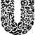

# U

The module contains 34 items.

| |Name|
|:---:|---|
|  | [simpleicons-7/U/Uber](../../simpleicons-7/U/Uber.md) |
|  | [simpleicons-7/U/Ubereats](../../simpleicons-7/U/Ubereats.md) |
|  | [simpleicons-7/U/Ubiquiti](../../simpleicons-7/U/Ubiquiti.md) |
|  | [simpleicons-7/U/Ubisoft](../../simpleicons-7/U/Ubisoft.md) |
|  | [simpleicons-7/U/Ublockorigin](../../simpleicons-7/U/Ublockorigin.md) |
|  | [simpleicons-7/U/Ubuntu](../../simpleicons-7/U/Ubuntu.md) |
|  | [simpleicons-7/U/Udacity](../../simpleicons-7/U/Udacity.md) |
|  | [simpleicons-7/U/Udemy](../../simpleicons-7/U/Udemy.md) |
|  | [simpleicons-7/U/Ufc](../../simpleicons-7/U/Ufc.md) |
|  | [simpleicons-7/U/Uikit](../../simpleicons-7/U/Uikit.md) |
|  | [simpleicons-7/U/Ulule](../../simpleicons-7/U/Ulule.md) |
|  | [simpleicons-7/U/Umbraco](../../simpleicons-7/U/Umbraco.md) |
|  | [simpleicons-7/U/Unacademy](../../simpleicons-7/U/Unacademy.md) |
|  | [simpleicons-7/U/Underarmour](../../simpleicons-7/U/Underarmour.md) |
|  | [simpleicons-7/U/Underscoredotjs](../../simpleicons-7/U/Underscoredotjs.md) |
|  | [simpleicons-7/U/Undertale](../../simpleicons-7/U/Undertale.md) |
|  | [simpleicons-7/U/Unicode](../../simpleicons-7/U/Unicode.md) |
|  | [simpleicons-7/U/Unilever](../../simpleicons-7/U/Unilever.md) |
|  | [simpleicons-7/U/Unitedairlines](../../simpleicons-7/U/Unitedairlines.md) |
|  | [simpleicons-7/U/Unity](../../simpleicons-7/U/Unity.md) |
|  | [simpleicons-7/U/Unocss](../../simpleicons-7/U/Unocss.md) |
|  | [simpleicons-7/U/Unraid](../../simpleicons-7/U/Unraid.md) |
|  | [simpleicons-7/U/Unrealengine](../../simpleicons-7/U/Unrealengine.md) |
|  | [simpleicons-7/U/Unsplash](../../simpleicons-7/U/Unsplash.md) |
|  | [simpleicons-7/U/Untangle](../../simpleicons-7/U/Untangle.md) |
|  | [simpleicons-7/U/Untappd](../../simpleicons-7/U/Untappd.md) |
|  | [simpleicons-7/U/Upcloud](../../simpleicons-7/U/Upcloud.md) |
|  | [simpleicons-7/U/Uplabs](../../simpleicons-7/U/Uplabs.md) |
|  | [simpleicons-7/U/Uploaded](../../simpleicons-7/U/Uploaded.md) |
|  | [simpleicons-7/U/Ups](../../simpleicons-7/U/Ups.md) |
|  | [simpleicons-7/U/Upstash](../../simpleicons-7/U/Upstash.md) |
|  | [simpleicons-7/U/Uptobox](../../simpleicons-7/U/Uptobox.md) |
|  | [simpleicons-7/U/Upwork](../../simpleicons-7/U/Upwork.md) |
|  | [simpleicons-7/U/Usps](../../simpleicons-7/U/Usps.md) |

