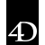

# _

The module contains 7 items.

| |Name|
|:---:|---|
|  | [simpleicons-7/_/_1001Tracklists](../../simpleicons-7/_/_1001Tracklists.md) |
|  | [simpleicons-7/_/_1Password](../../simpleicons-7/_/_1Password.md) |
|  | [simpleicons-7/_/_3M](../../simpleicons-7/_/_3M.md) |
|  | [simpleicons-7/_/_42](../../simpleicons-7/_/_42.md) |
|  | [simpleicons-7/_/_4Chan](../../simpleicons-7/_/_4Chan.md) |
|  | [simpleicons-7/_/_4D](../../simpleicons-7/_/_4D.md) |
|  | [simpleicons-7/_/_500Px](../../simpleicons-7/_/_500Px.md) |

