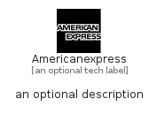

# Americanexpress


```text
simpleicons-8/A/Americanexpress
```

```text
include('simpleicons-8/A/Americanexpress')
```


| Illustration | Americanexpress |
| :---: | :---: |
|  |  |


## Sprites
The item provides the following sriptes:

- `<$AmericanexpressXs>`
- `<$AmericanexpressSm>`
- `<$AmericanexpressMd>`
- `<$AmericanexpressLg>`


## Americanexpress

### Load remotely
```plantuml
@startuml
' configures the library
!global $LIB_BASE_LOCATION="https://raw.githubusercontent.com/tmorin/plantuml-libs/master/distribution"

' loads the library's bootstrap
!include $LIB_BASE_LOCATION/bootstrap.puml

' loads the package bootstrap
include('simpleicons-8/bootstrap')

' loads the Item which embeds the element Americanexpress
include('simpleicons-8/A/Americanexpress')

' renders the element
Americanexpress('Americanexpress', 'Americanexpress', 'an optional tech label', 'an optional description')
@enduml
```

### Load locally
```plantuml
@startuml
' configures the library
!global $INCLUSION_MODE="local"
!global $LIB_BASE_LOCATION="../.."

' loads the library's bootstrap
!include $LIB_BASE_LOCATION/bootstrap.puml

' loads the package bootstrap
include('simpleicons-8/bootstrap')

' loads the Item which embeds the element Americanexpress
include('simpleicons-8/A/Americanexpress')

' renders the element
Americanexpress('Americanexpress', 'Americanexpress', 'an optional tech label', 'an optional description')
@enduml
```

