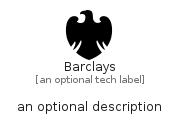

# Barclays


```text
simpleicons-8/B/Barclays
```

```text
include('simpleicons-8/B/Barclays')
```


| Illustration | Barclays |
| :---: | :---: |
|  |  |


## Sprites
The item provides the following sriptes:

- `<$BarclaysXs>`
- `<$BarclaysSm>`
- `<$BarclaysMd>`
- `<$BarclaysLg>`


## Barclays

### Load remotely
```plantuml
@startuml
' configures the library
!global $LIB_BASE_LOCATION="https://raw.githubusercontent.com/tmorin/plantuml-libs/master/distribution"

' loads the library's bootstrap
!include $LIB_BASE_LOCATION/bootstrap.puml

' loads the package bootstrap
include('simpleicons-8/bootstrap')

' loads the Item which embeds the element Barclays
include('simpleicons-8/B/Barclays')

' renders the element
Barclays('Barclays', 'Barclays', 'an optional tech label', 'an optional description')
@enduml
```

### Load locally
```plantuml
@startuml
' configures the library
!global $INCLUSION_MODE="local"
!global $LIB_BASE_LOCATION="../.."

' loads the library's bootstrap
!include $LIB_BASE_LOCATION/bootstrap.puml

' loads the package bootstrap
include('simpleicons-8/bootstrap')

' loads the Item which embeds the element Barclays
include('simpleicons-8/B/Barclays')

' renders the element
Barclays('Barclays', 'Barclays', 'an optional tech label', 'an optional description')
@enduml
```

