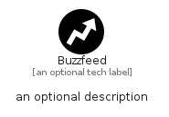

# Buzzfeed


```text
simpleicons-8/B/Buzzfeed
```

```text
include('simpleicons-8/B/Buzzfeed')
```


| Illustration | Buzzfeed |
| :---: | :---: |
|  |  |


## Sprites
The item provides the following sriptes:

- `<$BuzzfeedXs>`
- `<$BuzzfeedSm>`
- `<$BuzzfeedMd>`
- `<$BuzzfeedLg>`


## Buzzfeed

### Load remotely
```plantuml
@startuml
' configures the library
!global $LIB_BASE_LOCATION="https://raw.githubusercontent.com/tmorin/plantuml-libs/master/distribution"

' loads the library's bootstrap
!include $LIB_BASE_LOCATION/bootstrap.puml

' loads the package bootstrap
include('simpleicons-8/bootstrap')

' loads the Item which embeds the element Buzzfeed
include('simpleicons-8/B/Buzzfeed')

' renders the element
Buzzfeed('Buzzfeed', 'Buzzfeed', 'an optional tech label', 'an optional description')
@enduml
```

### Load locally
```plantuml
@startuml
' configures the library
!global $INCLUSION_MODE="local"
!global $LIB_BASE_LOCATION="../.."

' loads the library's bootstrap
!include $LIB_BASE_LOCATION/bootstrap.puml

' loads the package bootstrap
include('simpleicons-8/bootstrap')

' loads the Item which embeds the element Buzzfeed
include('simpleicons-8/B/Buzzfeed')

' renders the element
Buzzfeed('Buzzfeed', 'Buzzfeed', 'an optional tech label', 'an optional description')
@enduml
```

