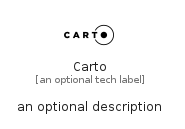

# Carto


```text
simpleicons-8/C/Carto
```

```text
include('simpleicons-8/C/Carto')
```


| Illustration | Carto |
| :---: | :---: |
|  |  |


## Sprites
The item provides the following sriptes:

- `<$CartoXs>`
- `<$CartoSm>`
- `<$CartoMd>`
- `<$CartoLg>`


## Carto

### Load remotely
```plantuml
@startuml
' configures the library
!global $LIB_BASE_LOCATION="https://raw.githubusercontent.com/tmorin/plantuml-libs/master/distribution"

' loads the library's bootstrap
!include $LIB_BASE_LOCATION/bootstrap.puml

' loads the package bootstrap
include('simpleicons-8/bootstrap')

' loads the Item which embeds the element Carto
include('simpleicons-8/C/Carto')

' renders the element
Carto('Carto', 'Carto', 'an optional tech label', 'an optional description')
@enduml
```

### Load locally
```plantuml
@startuml
' configures the library
!global $INCLUSION_MODE="local"
!global $LIB_BASE_LOCATION="../.."

' loads the library's bootstrap
!include $LIB_BASE_LOCATION/bootstrap.puml

' loads the package bootstrap
include('simpleicons-8/bootstrap')

' loads the Item which embeds the element Carto
include('simpleicons-8/C/Carto')

' renders the element
Carto('Carto', 'Carto', 'an optional tech label', 'an optional description')
@enduml
```

