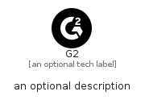

# G2


```text
simpleicons-8/G/G2
```

```text
include('simpleicons-8/G/G2')
```


| Illustration | G2 |
| :---: | :---: |
|  |  |


## Sprites
The item provides the following sriptes:

- `<$G2Xs>`
- `<$G2Sm>`
- `<$G2Md>`
- `<$G2Lg>`


## G2

### Load remotely
```plantuml
@startuml
' configures the library
!global $LIB_BASE_LOCATION="https://raw.githubusercontent.com/tmorin/plantuml-libs/master/distribution"

' loads the library's bootstrap
!include $LIB_BASE_LOCATION/bootstrap.puml

' loads the package bootstrap
include('simpleicons-8/bootstrap')

' loads the Item which embeds the element G2
include('simpleicons-8/G/G2')

' renders the element
G2('G2', 'G2', 'an optional tech label', 'an optional description')
@enduml
```

### Load locally
```plantuml
@startuml
' configures the library
!global $INCLUSION_MODE="local"
!global $LIB_BASE_LOCATION="../.."

' loads the library's bootstrap
!include $LIB_BASE_LOCATION/bootstrap.puml

' loads the package bootstrap
include('simpleicons-8/bootstrap')

' loads the Item which embeds the element G2
include('simpleicons-8/G/G2')

' renders the element
G2('G2', 'G2', 'an optional tech label', 'an optional description')
@enduml
```

