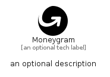

# Moneygram


```text
simpleicons-8/M/Moneygram
```

```text
include('simpleicons-8/M/Moneygram')
```


| Illustration | Moneygram |
| :---: | :---: |
|  |  |


## Sprites
The item provides the following sriptes:

- `<$MoneygramXs>`
- `<$MoneygramSm>`
- `<$MoneygramMd>`
- `<$MoneygramLg>`


## Moneygram

### Load remotely
```plantuml
@startuml
' configures the library
!global $LIB_BASE_LOCATION="https://raw.githubusercontent.com/tmorin/plantuml-libs/master/distribution"

' loads the library's bootstrap
!include $LIB_BASE_LOCATION/bootstrap.puml

' loads the package bootstrap
include('simpleicons-8/bootstrap')

' loads the Item which embeds the element Moneygram
include('simpleicons-8/M/Moneygram')

' renders the element
Moneygram('Moneygram', 'Moneygram', 'an optional tech label', 'an optional description')
@enduml
```

### Load locally
```plantuml
@startuml
' configures the library
!global $INCLUSION_MODE="local"
!global $LIB_BASE_LOCATION="../.."

' loads the library's bootstrap
!include $LIB_BASE_LOCATION/bootstrap.puml

' loads the package bootstrap
include('simpleicons-8/bootstrap')

' loads the Item which embeds the element Moneygram
include('simpleicons-8/M/Moneygram')

' renders the element
Moneygram('Moneygram', 'Moneygram', 'an optional tech label', 'an optional description')
@enduml
```

