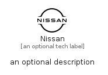

# Nissan


```text
simpleicons-8/N/Nissan
```

```text
include('simpleicons-8/N/Nissan')
```


| Illustration | Nissan |
| :---: | :---: |
|  |  |


## Sprites
The item provides the following sriptes:

- `<$NissanXs>`
- `<$NissanSm>`
- `<$NissanMd>`
- `<$NissanLg>`


## Nissan

### Load remotely
```plantuml
@startuml
' configures the library
!global $LIB_BASE_LOCATION="https://raw.githubusercontent.com/tmorin/plantuml-libs/master/distribution"

' loads the library's bootstrap
!include $LIB_BASE_LOCATION/bootstrap.puml

' loads the package bootstrap
include('simpleicons-8/bootstrap')

' loads the Item which embeds the element Nissan
include('simpleicons-8/N/Nissan')

' renders the element
Nissan('Nissan', 'Nissan', 'an optional tech label', 'an optional description')
@enduml
```

### Load locally
```plantuml
@startuml
' configures the library
!global $INCLUSION_MODE="local"
!global $LIB_BASE_LOCATION="../.."

' loads the library's bootstrap
!include $LIB_BASE_LOCATION/bootstrap.puml

' loads the package bootstrap
include('simpleicons-8/bootstrap')

' loads the Item which embeds the element Nissan
include('simpleicons-8/N/Nissan')

' renders the element
Nissan('Nissan', 'Nissan', 'an optional tech label', 'an optional description')
@enduml
```

