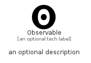

# Observable


```text
simpleicons-8/O/Observable
```

```text
include('simpleicons-8/O/Observable')
```


| Illustration | Observable |
| :---: | :---: |
|  |  |


## Sprites
The item provides the following sriptes:

- `<$ObservableXs>`
- `<$ObservableSm>`
- `<$ObservableMd>`
- `<$ObservableLg>`


## Observable

### Load remotely
```plantuml
@startuml
' configures the library
!global $LIB_BASE_LOCATION="https://raw.githubusercontent.com/tmorin/plantuml-libs/master/distribution"

' loads the library's bootstrap
!include $LIB_BASE_LOCATION/bootstrap.puml

' loads the package bootstrap
include('simpleicons-8/bootstrap')

' loads the Item which embeds the element Observable
include('simpleicons-8/O/Observable')

' renders the element
Observable('Observable', 'Observable', 'an optional tech label', 'an optional description')
@enduml
```

### Load locally
```plantuml
@startuml
' configures the library
!global $INCLUSION_MODE="local"
!global $LIB_BASE_LOCATION="../.."

' loads the library's bootstrap
!include $LIB_BASE_LOCATION/bootstrap.puml

' loads the package bootstrap
include('simpleicons-8/bootstrap')

' loads the Item which embeds the element Observable
include('simpleicons-8/O/Observable')

' renders the element
Observable('Observable', 'Observable', 'an optional tech label', 'an optional description')
@enduml
```

