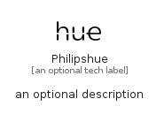

# Philipshue


```text
simpleicons-8/P/Philipshue
```

```text
include('simpleicons-8/P/Philipshue')
```


| Illustration | Philipshue |
| :---: | :---: |
|  |  |


## Sprites
The item provides the following sriptes:

- `<$PhilipshueXs>`
- `<$PhilipshueSm>`
- `<$PhilipshueMd>`
- `<$PhilipshueLg>`


## Philipshue

### Load remotely
```plantuml
@startuml
' configures the library
!global $LIB_BASE_LOCATION="https://raw.githubusercontent.com/tmorin/plantuml-libs/master/distribution"

' loads the library's bootstrap
!include $LIB_BASE_LOCATION/bootstrap.puml

' loads the package bootstrap
include('simpleicons-8/bootstrap')

' loads the Item which embeds the element Philipshue
include('simpleicons-8/P/Philipshue')

' renders the element
Philipshue('Philipshue', 'Philipshue', 'an optional tech label', 'an optional description')
@enduml
```

### Load locally
```plantuml
@startuml
' configures the library
!global $INCLUSION_MODE="local"
!global $LIB_BASE_LOCATION="../.."

' loads the library's bootstrap
!include $LIB_BASE_LOCATION/bootstrap.puml

' loads the package bootstrap
include('simpleicons-8/bootstrap')

' loads the Item which embeds the element Philipshue
include('simpleicons-8/P/Philipshue')

' renders the element
Philipshue('Philipshue', 'Philipshue', 'an optional tech label', 'an optional description')
@enduml
```

