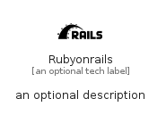

# Rubyonrails


```text
simpleicons-8/R/Rubyonrails
```

```text
include('simpleicons-8/R/Rubyonrails')
```


| Illustration | Rubyonrails |
| :---: | :---: |
|  |  |


## Sprites
The item provides the following sriptes:

- `<$RubyonrailsXs>`
- `<$RubyonrailsSm>`
- `<$RubyonrailsMd>`
- `<$RubyonrailsLg>`


## Rubyonrails

### Load remotely
```plantuml
@startuml
' configures the library
!global $LIB_BASE_LOCATION="https://raw.githubusercontent.com/tmorin/plantuml-libs/master/distribution"

' loads the library's bootstrap
!include $LIB_BASE_LOCATION/bootstrap.puml

' loads the package bootstrap
include('simpleicons-8/bootstrap')

' loads the Item which embeds the element Rubyonrails
include('simpleicons-8/R/Rubyonrails')

' renders the element
Rubyonrails('Rubyonrails', 'Rubyonrails', 'an optional tech label', 'an optional description')
@enduml
```

### Load locally
```plantuml
@startuml
' configures the library
!global $INCLUSION_MODE="local"
!global $LIB_BASE_LOCATION="../.."

' loads the library's bootstrap
!include $LIB_BASE_LOCATION/bootstrap.puml

' loads the package bootstrap
include('simpleicons-8/bootstrap')

' loads the Item which embeds the element Rubyonrails
include('simpleicons-8/R/Rubyonrails')

' renders the element
Rubyonrails('Rubyonrails', 'Rubyonrails', 'an optional tech label', 'an optional description')
@enduml
```

