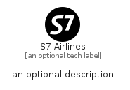

# S7Airlines


```text
simpleicons-8/S/S7Airlines
```

```text
include('simpleicons-8/S/S7Airlines')
```


| Illustration | S7Airlines |
| :---: | :---: |
|  |  |


## S7Airlines

### Load remotely
```plantuml
@startuml
' configures the library
!global $LIB_BASE_LOCATION="https://raw.githubusercontent.com/tmorin/plantuml-libs/master/distribution"

' loads the library's bootstrap
!include $LIB_BASE_LOCATION/bootstrap.puml

' loads the package bootstrap
include('simpleicons-8/bootstrap')

' loads the Item which embeds the element S7Airlines
include('simpleicons-8/S/S7Airlines')

' renders the element
S7Airlines('S7Airlines', 'S7 Airlines', 'an optional tech label', 'an optional description')
@enduml
```

### Load locally
```plantuml
@startuml
' configures the library
!global $INCLUSION_MODE="local"
!global $LIB_BASE_LOCATION="../.."

' loads the library's bootstrap
!include $LIB_BASE_LOCATION/bootstrap.puml

' loads the package bootstrap
include('simpleicons-8/bootstrap')

' loads the Item which embeds the element S7Airlines
include('simpleicons-8/S/S7Airlines')

' renders the element
S7Airlines('S7Airlines', 'S7 Airlines', 'an optional tech label', 'an optional description')
@enduml
```

