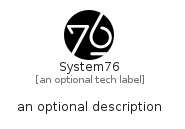

# System76


```text
simpleicons-8/S/System76
```

```text
include('simpleicons-8/S/System76')
```


| Illustration | System76 |
| :---: | :---: |
|  |  |


## Sprites
The item provides the following sriptes:

- `<$System76Xs>`
- `<$System76Sm>`
- `<$System76Md>`
- `<$System76Lg>`


## System76

### Load remotely
```plantuml
@startuml
' configures the library
!global $LIB_BASE_LOCATION="https://raw.githubusercontent.com/tmorin/plantuml-libs/master/distribution"

' loads the library's bootstrap
!include $LIB_BASE_LOCATION/bootstrap.puml

' loads the package bootstrap
include('simpleicons-8/bootstrap')

' loads the Item which embeds the element System76
include('simpleicons-8/S/System76')

' renders the element
System76('System76', 'System76', 'an optional tech label', 'an optional description')
@enduml
```

### Load locally
```plantuml
@startuml
' configures the library
!global $INCLUSION_MODE="local"
!global $LIB_BASE_LOCATION="../.."

' loads the library's bootstrap
!include $LIB_BASE_LOCATION/bootstrap.puml

' loads the package bootstrap
include('simpleicons-8/bootstrap')

' loads the Item which embeds the element System76
include('simpleicons-8/S/System76')

' renders the element
System76('System76', 'System76', 'an optional tech label', 'an optional description')
@enduml
```

