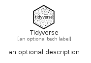

# Tidyverse


```text
simpleicons-8/T/Tidyverse
```

```text
include('simpleicons-8/T/Tidyverse')
```


| Illustration | Tidyverse |
| :---: | :---: |
|  |  |


## Sprites
The item provides the following sriptes:

- `<$TidyverseXs>`
- `<$TidyverseSm>`
- `<$TidyverseMd>`
- `<$TidyverseLg>`


## Tidyverse

### Load remotely
```plantuml
@startuml
' configures the library
!global $LIB_BASE_LOCATION="https://raw.githubusercontent.com/tmorin/plantuml-libs/master/distribution"

' loads the library's bootstrap
!include $LIB_BASE_LOCATION/bootstrap.puml

' loads the package bootstrap
include('simpleicons-8/bootstrap')

' loads the Item which embeds the element Tidyverse
include('simpleicons-8/T/Tidyverse')

' renders the element
Tidyverse('Tidyverse', 'Tidyverse', 'an optional tech label', 'an optional description')
@enduml
```

### Load locally
```plantuml
@startuml
' configures the library
!global $INCLUSION_MODE="local"
!global $LIB_BASE_LOCATION="../.."

' loads the library's bootstrap
!include $LIB_BASE_LOCATION/bootstrap.puml

' loads the package bootstrap
include('simpleicons-8/bootstrap')

' loads the Item which embeds the element Tidyverse
include('simpleicons-8/T/Tidyverse')

' renders the element
Tidyverse('Tidyverse', 'Tidyverse', 'an optional tech label', 'an optional description')
@enduml
```

