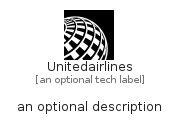

# Unitedairlines


```text
simpleicons-8/U/Unitedairlines
```

```text
include('simpleicons-8/U/Unitedairlines')
```


| Illustration | Unitedairlines |
| :---: | :---: |
|  |  |


## Sprites
The item provides the following sriptes:

- `<$UnitedairlinesXs>`
- `<$UnitedairlinesSm>`
- `<$UnitedairlinesMd>`
- `<$UnitedairlinesLg>`


## Unitedairlines

### Load remotely
```plantuml
@startuml
' configures the library
!global $LIB_BASE_LOCATION="https://raw.githubusercontent.com/tmorin/plantuml-libs/master/distribution"

' loads the library's bootstrap
!include $LIB_BASE_LOCATION/bootstrap.puml

' loads the package bootstrap
include('simpleicons-8/bootstrap')

' loads the Item which embeds the element Unitedairlines
include('simpleicons-8/U/Unitedairlines')

' renders the element
Unitedairlines('Unitedairlines', 'Unitedairlines', 'an optional tech label', 'an optional description')
@enduml
```

### Load locally
```plantuml
@startuml
' configures the library
!global $INCLUSION_MODE="local"
!global $LIB_BASE_LOCATION="../.."

' loads the library's bootstrap
!include $LIB_BASE_LOCATION/bootstrap.puml

' loads the package bootstrap
include('simpleicons-8/bootstrap')

' loads the Item which embeds the element Unitedairlines
include('simpleicons-8/U/Unitedairlines')

' renders the element
Unitedairlines('Unitedairlines', 'Unitedairlines', 'an optional tech label', 'an optional description')
@enduml
```

