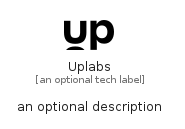

# Uplabs


```text
simpleicons-8/U/Uplabs
```

```text
include('simpleicons-8/U/Uplabs')
```


| Illustration | Uplabs |
| :---: | :---: |
|  |  |


## Sprites
The item provides the following sriptes:

- `<$UplabsXs>`
- `<$UplabsSm>`
- `<$UplabsMd>`
- `<$UplabsLg>`


## Uplabs

### Load remotely
```plantuml
@startuml
' configures the library
!global $LIB_BASE_LOCATION="https://raw.githubusercontent.com/tmorin/plantuml-libs/master/distribution"

' loads the library's bootstrap
!include $LIB_BASE_LOCATION/bootstrap.puml

' loads the package bootstrap
include('simpleicons-8/bootstrap')

' loads the Item which embeds the element Uplabs
include('simpleicons-8/U/Uplabs')

' renders the element
Uplabs('Uplabs', 'Uplabs', 'an optional tech label', 'an optional description')
@enduml
```

### Load locally
```plantuml
@startuml
' configures the library
!global $INCLUSION_MODE="local"
!global $LIB_BASE_LOCATION="../.."

' loads the library's bootstrap
!include $LIB_BASE_LOCATION/bootstrap.puml

' loads the package bootstrap
include('simpleicons-8/bootstrap')

' loads the Item which embeds the element Uplabs
include('simpleicons-8/U/Uplabs')

' renders the element
Uplabs('Uplabs', 'Uplabs', 'an optional tech label', 'an optional description')
@enduml
```

