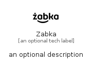

# Zabka


```text
simpleicons-8/Z/Zabka
```

```text
include('simpleicons-8/Z/Zabka')
```


| Illustration | Zabka |
| :---: | :---: |
|  |  |


## Sprites
The item provides the following sriptes:

- `<$ZabkaXs>`
- `<$ZabkaSm>`
- `<$ZabkaMd>`
- `<$ZabkaLg>`


## Zabka

### Load remotely
```plantuml
@startuml
' configures the library
!global $LIB_BASE_LOCATION="https://raw.githubusercontent.com/tmorin/plantuml-libs/master/distribution"

' loads the library's bootstrap
!include $LIB_BASE_LOCATION/bootstrap.puml

' loads the package bootstrap
include('simpleicons-8/bootstrap')

' loads the Item which embeds the element Zabka
include('simpleicons-8/Z/Zabka')

' renders the element
Zabka('Zabka', 'Zabka', 'an optional tech label', 'an optional description')
@enduml
```

### Load locally
```plantuml
@startuml
' configures the library
!global $INCLUSION_MODE="local"
!global $LIB_BASE_LOCATION="../.."

' loads the library's bootstrap
!include $LIB_BASE_LOCATION/bootstrap.puml

' loads the package bootstrap
include('simpleicons-8/bootstrap')

' loads the Item which embeds the element Zabka
include('simpleicons-8/Z/Zabka')

' renders the element
Zabka('Zabka', 'Zabka', 'an optional tech label', 'an optional description')
@enduml
```

