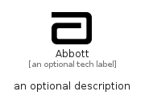

# Abbott


```text
simpleicons/A/Abbott
```

```text
include('simpleicons/A/Abbott')
```


| Illustration | Abbott |
| :---: | :---: |
|  |  |


## Sprites
The item provides the following sriptes:

- `<$AbbottXs>`
- `<$AbbottSm>`
- `<$AbbottMd>`
- `<$AbbottLg>`


## Abbott

### Load remotely
```plantuml
@startuml
' configures the library
!global $LIB_BASE_LOCATION="https://raw.githubusercontent.com/tmorin/plantuml-libs/master/distribution"

' loads the library's bootstrap
!include $LIB_BASE_LOCATION/bootstrap.puml

' loads the package bootstrap
include('simpleicons/bootstrap')

' loads the Item which embeds the element Abbott
include('simpleicons/A/Abbott')

' renders the element
Abbott('Abbott', 'Abbott', 'an optional tech label', 'an optional description')
@enduml
```

### Load locally
```plantuml
@startuml
' configures the library
!global $INCLUSION_MODE="local"
!global $LIB_BASE_LOCATION="../.."

' loads the library's bootstrap
!include $LIB_BASE_LOCATION/bootstrap.puml

' loads the package bootstrap
include('simpleicons/bootstrap')

' loads the Item which embeds the element Abbott
include('simpleicons/A/Abbott')

' renders the element
Abbott('Abbott', 'Abbott', 'an optional tech label', 'an optional description')
@enduml
```

