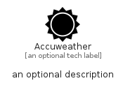

# Accuweather


```text
simpleicons/A/Accuweather
```

```text
include('simpleicons/A/Accuweather')
```


| Illustration | Accuweather |
| :---: | :---: |
|  |  |


## Sprites
The item provides the following sriptes:

- `<$AccuweatherXs>`
- `<$AccuweatherSm>`
- `<$AccuweatherMd>`
- `<$AccuweatherLg>`


## Accuweather

### Load remotely
```plantuml
@startuml
' configures the library
!global $LIB_BASE_LOCATION="https://raw.githubusercontent.com/tmorin/plantuml-libs/master/distribution"

' loads the library's bootstrap
!include $LIB_BASE_LOCATION/bootstrap.puml

' loads the package bootstrap
include('simpleicons/bootstrap')

' loads the Item which embeds the element Accuweather
include('simpleicons/A/Accuweather')

' renders the element
Accuweather('Accuweather', 'Accuweather', 'an optional tech label', 'an optional description')
@enduml
```

### Load locally
```plantuml
@startuml
' configures the library
!global $INCLUSION_MODE="local"
!global $LIB_BASE_LOCATION="../.."

' loads the library's bootstrap
!include $LIB_BASE_LOCATION/bootstrap.puml

' loads the package bootstrap
include('simpleicons/bootstrap')

' loads the Item which embeds the element Accuweather
include('simpleicons/A/Accuweather')

' renders the element
Accuweather('Accuweather', 'Accuweather', 'an optional tech label', 'an optional description')
@enduml
```

