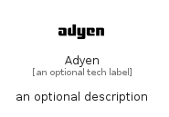

# Adyen


```text
simpleicons/A/Adyen
```

```text
include('simpleicons/A/Adyen')
```


| Illustration | Adyen |
| :---: | :---: |
|  |  |


## Sprites
The item provides the following sriptes:

- `<$AdyenXs>`
- `<$AdyenSm>`
- `<$AdyenMd>`
- `<$AdyenLg>`


## Adyen

### Load remotely
```plantuml
@startuml
' configures the library
!global $LIB_BASE_LOCATION="https://raw.githubusercontent.com/tmorin/plantuml-libs/master/distribution"

' loads the library's bootstrap
!include $LIB_BASE_LOCATION/bootstrap.puml

' loads the package bootstrap
include('simpleicons/bootstrap')

' loads the Item which embeds the element Adyen
include('simpleicons/A/Adyen')

' renders the element
Adyen('Adyen', 'Adyen', 'an optional tech label', 'an optional description')
@enduml
```

### Load locally
```plantuml
@startuml
' configures the library
!global $INCLUSION_MODE="local"
!global $LIB_BASE_LOCATION="../.."

' loads the library's bootstrap
!include $LIB_BASE_LOCATION/bootstrap.puml

' loads the package bootstrap
include('simpleicons/bootstrap')

' loads the Item which embeds the element Adyen
include('simpleicons/A/Adyen')

' renders the element
Adyen('Adyen', 'Adyen', 'an optional tech label', 'an optional description')
@enduml
```

