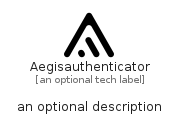

# Aegisauthenticator


```text
simpleicons/A/Aegisauthenticator
```

```text
include('simpleicons/A/Aegisauthenticator')
```


| Illustration | Aegisauthenticator |
| :---: | :---: |
|  |  |


## Sprites
The item provides the following sriptes:

- `<$AegisauthenticatorXs>`
- `<$AegisauthenticatorSm>`
- `<$AegisauthenticatorMd>`
- `<$AegisauthenticatorLg>`


## Aegisauthenticator

### Load remotely
```plantuml
@startuml
' configures the library
!global $LIB_BASE_LOCATION="https://raw.githubusercontent.com/tmorin/plantuml-libs/master/distribution"

' loads the library's bootstrap
!include $LIB_BASE_LOCATION/bootstrap.puml

' loads the package bootstrap
include('simpleicons/bootstrap')

' loads the Item which embeds the element Aegisauthenticator
include('simpleicons/A/Aegisauthenticator')

' renders the element
Aegisauthenticator('Aegisauthenticator', 'Aegisauthenticator', 'an optional tech label', 'an optional description')
@enduml
```

### Load locally
```plantuml
@startuml
' configures the library
!global $INCLUSION_MODE="local"
!global $LIB_BASE_LOCATION="../.."

' loads the library's bootstrap
!include $LIB_BASE_LOCATION/bootstrap.puml

' loads the package bootstrap
include('simpleicons/bootstrap')

' loads the Item which embeds the element Aegisauthenticator
include('simpleicons/A/Aegisauthenticator')

' renders the element
Aegisauthenticator('Aegisauthenticator', 'Aegisauthenticator', 'an optional tech label', 'an optional description')
@enduml
```

