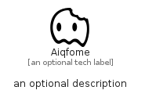

# Aiqfome


```text
simpleicons/A/Aiqfome
```

```text
include('simpleicons/A/Aiqfome')
```


| Illustration | Aiqfome |
| :---: | :---: |
|  |  |


## Sprites
The item provides the following sriptes:

- `<$AiqfomeXs>`
- `<$AiqfomeSm>`
- `<$AiqfomeMd>`
- `<$AiqfomeLg>`


## Aiqfome

### Load remotely
```plantuml
@startuml
' configures the library
!global $LIB_BASE_LOCATION="https://raw.githubusercontent.com/tmorin/plantuml-libs/master/distribution"

' loads the library's bootstrap
!include $LIB_BASE_LOCATION/bootstrap.puml

' loads the package bootstrap
include('simpleicons/bootstrap')

' loads the Item which embeds the element Aiqfome
include('simpleicons/A/Aiqfome')

' renders the element
Aiqfome('Aiqfome', 'Aiqfome', 'an optional tech label', 'an optional description')
@enduml
```

### Load locally
```plantuml
@startuml
' configures the library
!global $INCLUSION_MODE="local"
!global $LIB_BASE_LOCATION="../.."

' loads the library's bootstrap
!include $LIB_BASE_LOCATION/bootstrap.puml

' loads the package bootstrap
include('simpleicons/bootstrap')

' loads the Item which embeds the element Aiqfome
include('simpleicons/A/Aiqfome')

' renders the element
Aiqfome('Aiqfome', 'Aiqfome', 'an optional tech label', 'an optional description')
@enduml
```

