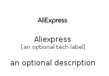

# Aliexpress


```text
simpleicons/A/Aliexpress
```

```text
include('simpleicons/A/Aliexpress')
```


| Illustration | Aliexpress |
| :---: | :---: |
|  |  |


## Sprites
The item provides the following sriptes:

- `<$AliexpressXs>`
- `<$AliexpressSm>`
- `<$AliexpressMd>`
- `<$AliexpressLg>`


## Aliexpress

### Load remotely
```plantuml
@startuml
' configures the library
!global $LIB_BASE_LOCATION="https://raw.githubusercontent.com/tmorin/plantuml-libs/master/distribution"

' loads the library's bootstrap
!include $LIB_BASE_LOCATION/bootstrap.puml

' loads the package bootstrap
include('simpleicons/bootstrap')

' loads the Item which embeds the element Aliexpress
include('simpleicons/A/Aliexpress')

' renders the element
Aliexpress('Aliexpress', 'Aliexpress', 'an optional tech label', 'an optional description')
@enduml
```

### Load locally
```plantuml
@startuml
' configures the library
!global $INCLUSION_MODE="local"
!global $LIB_BASE_LOCATION="../.."

' loads the library's bootstrap
!include $LIB_BASE_LOCATION/bootstrap.puml

' loads the package bootstrap
include('simpleicons/bootstrap')

' loads the Item which embeds the element Aliexpress
include('simpleicons/A/Aliexpress')

' renders the element
Aliexpress('Aliexpress', 'Aliexpress', 'an optional tech label', 'an optional description')
@enduml
```

