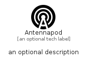

# Antennapod


```text
simpleicons/A/Antennapod
```

```text
include('simpleicons/A/Antennapod')
```


| Illustration | Antennapod |
| :---: | :---: |
|  |  |


## Sprites
The item provides the following sriptes:

- `<$AntennapodXs>`
- `<$AntennapodSm>`
- `<$AntennapodMd>`
- `<$AntennapodLg>`


## Antennapod

### Load remotely
```plantuml
@startuml
' configures the library
!global $LIB_BASE_LOCATION="https://raw.githubusercontent.com/tmorin/plantuml-libs/master/distribution"

' loads the library's bootstrap
!include $LIB_BASE_LOCATION/bootstrap.puml

' loads the package bootstrap
include('simpleicons/bootstrap')

' loads the Item which embeds the element Antennapod
include('simpleicons/A/Antennapod')

' renders the element
Antennapod('Antennapod', 'Antennapod', 'an optional tech label', 'an optional description')
@enduml
```

### Load locally
```plantuml
@startuml
' configures the library
!global $INCLUSION_MODE="local"
!global $LIB_BASE_LOCATION="../.."

' loads the library's bootstrap
!include $LIB_BASE_LOCATION/bootstrap.puml

' loads the package bootstrap
include('simpleicons/bootstrap')

' loads the Item which embeds the element Antennapod
include('simpleicons/A/Antennapod')

' renders the element
Antennapod('Antennapod', 'Antennapod', 'an optional tech label', 'an optional description')
@enduml
```

