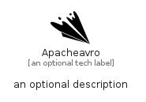

# Apacheavro


```text
simpleicons/A/Apacheavro
```

```text
include('simpleicons/A/Apacheavro')
```


| Illustration | Apacheavro |
| :---: | :---: |
|  |  |


## Sprites
The item provides the following sriptes:

- `<$ApacheavroXs>`
- `<$ApacheavroSm>`
- `<$ApacheavroMd>`
- `<$ApacheavroLg>`


## Apacheavro

### Load remotely
```plantuml
@startuml
' configures the library
!global $LIB_BASE_LOCATION="https://raw.githubusercontent.com/tmorin/plantuml-libs/master/distribution"

' loads the library's bootstrap
!include $LIB_BASE_LOCATION/bootstrap.puml

' loads the package bootstrap
include('simpleicons/bootstrap')

' loads the Item which embeds the element Apacheavro
include('simpleicons/A/Apacheavro')

' renders the element
Apacheavro('Apacheavro', 'Apacheavro', 'an optional tech label', 'an optional description')
@enduml
```

### Load locally
```plantuml
@startuml
' configures the library
!global $INCLUSION_MODE="local"
!global $LIB_BASE_LOCATION="../.."

' loads the library's bootstrap
!include $LIB_BASE_LOCATION/bootstrap.puml

' loads the package bootstrap
include('simpleicons/bootstrap')

' loads the Item which embeds the element Apacheavro
include('simpleicons/A/Apacheavro')

' renders the element
Apacheavro('Apacheavro', 'Apacheavro', 'an optional tech label', 'an optional description')
@enduml
```

