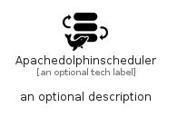

# Apachedolphinscheduler


```text
simpleicons/A/Apachedolphinscheduler
```

```text
include('simpleicons/A/Apachedolphinscheduler')
```


| Illustration | Apachedolphinscheduler |
| :---: | :---: |
|  |  |


## Sprites
The item provides the following sriptes:

- `<$ApachedolphinschedulerXs>`
- `<$ApachedolphinschedulerSm>`
- `<$ApachedolphinschedulerMd>`
- `<$ApachedolphinschedulerLg>`


## Apachedolphinscheduler

### Load remotely
```plantuml
@startuml
' configures the library
!global $LIB_BASE_LOCATION="https://raw.githubusercontent.com/tmorin/plantuml-libs/master/distribution"

' loads the library's bootstrap
!include $LIB_BASE_LOCATION/bootstrap.puml

' loads the package bootstrap
include('simpleicons/bootstrap')

' loads the Item which embeds the element Apachedolphinscheduler
include('simpleicons/A/Apachedolphinscheduler')

' renders the element
Apachedolphinscheduler('Apachedolphinscheduler', 'Apachedolphinscheduler', 'an optional tech label', 'an optional description')
@enduml
```

### Load locally
```plantuml
@startuml
' configures the library
!global $INCLUSION_MODE="local"
!global $LIB_BASE_LOCATION="../.."

' loads the library's bootstrap
!include $LIB_BASE_LOCATION/bootstrap.puml

' loads the package bootstrap
include('simpleicons/bootstrap')

' loads the Item which embeds the element Apachedolphinscheduler
include('simpleicons/A/Apachedolphinscheduler')

' renders the element
Apachedolphinscheduler('Apachedolphinscheduler', 'Apachedolphinscheduler', 'an optional tech label', 'an optional description')
@enduml
```

