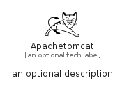

# Apachetomcat


```text
simpleicons/A/Apachetomcat
```

```text
include('simpleicons/A/Apachetomcat')
```


| Illustration | Apachetomcat |
| :---: | :---: |
|  |  |


## Sprites
The item provides the following sriptes:

- `<$ApachetomcatXs>`
- `<$ApachetomcatSm>`
- `<$ApachetomcatMd>`
- `<$ApachetomcatLg>`


## Apachetomcat

### Load remotely
```plantuml
@startuml
' configures the library
!global $LIB_BASE_LOCATION="https://raw.githubusercontent.com/tmorin/plantuml-libs/master/distribution"

' loads the library's bootstrap
!include $LIB_BASE_LOCATION/bootstrap.puml

' loads the package bootstrap
include('simpleicons/bootstrap')

' loads the Item which embeds the element Apachetomcat
include('simpleicons/A/Apachetomcat')

' renders the element
Apachetomcat('Apachetomcat', 'Apachetomcat', 'an optional tech label', 'an optional description')
@enduml
```

### Load locally
```plantuml
@startuml
' configures the library
!global $INCLUSION_MODE="local"
!global $LIB_BASE_LOCATION="../.."

' loads the library's bootstrap
!include $LIB_BASE_LOCATION/bootstrap.puml

' loads the package bootstrap
include('simpleicons/bootstrap')

' loads the Item which embeds the element Apachetomcat
include('simpleicons/A/Apachetomcat')

' renders the element
Apachetomcat('Apachetomcat', 'Apachetomcat', 'an optional tech label', 'an optional description')
@enduml
```

