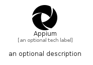

# Appium


```text
simpleicons/A/Appium
```

```text
include('simpleicons/A/Appium')
```


| Illustration | Appium |
| :---: | :---: |
|  |  |


## Sprites
The item provides the following sriptes:

- `<$AppiumXs>`
- `<$AppiumSm>`
- `<$AppiumMd>`
- `<$AppiumLg>`


## Appium

### Load remotely
```plantuml
@startuml
' configures the library
!global $LIB_BASE_LOCATION="https://raw.githubusercontent.com/tmorin/plantuml-libs/master/distribution"

' loads the library's bootstrap
!include $LIB_BASE_LOCATION/bootstrap.puml

' loads the package bootstrap
include('simpleicons/bootstrap')

' loads the Item which embeds the element Appium
include('simpleicons/A/Appium')

' renders the element
Appium('Appium', 'Appium', 'an optional tech label', 'an optional description')
@enduml
```

### Load locally
```plantuml
@startuml
' configures the library
!global $INCLUSION_MODE="local"
!global $LIB_BASE_LOCATION="../.."

' loads the library's bootstrap
!include $LIB_BASE_LOCATION/bootstrap.puml

' loads the package bootstrap
include('simpleicons/bootstrap')

' loads the Item which embeds the element Appium
include('simpleicons/A/Appium')

' renders the element
Appium('Appium', 'Appium', 'an optional tech label', 'an optional description')
@enduml
```

