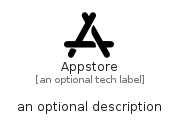

# Appstore


```text
simpleicons/A/Appstore
```

```text
include('simpleicons/A/Appstore')
```


| Illustration | Appstore |
| :---: | :---: |
|  |  |


## Sprites
The item provides the following sriptes:

- `<$AppstoreXs>`
- `<$AppstoreSm>`
- `<$AppstoreMd>`
- `<$AppstoreLg>`


## Appstore

### Load remotely
```plantuml
@startuml
' configures the library
!global $LIB_BASE_LOCATION="https://raw.githubusercontent.com/tmorin/plantuml-libs/master/distribution"

' loads the library's bootstrap
!include $LIB_BASE_LOCATION/bootstrap.puml

' loads the package bootstrap
include('simpleicons/bootstrap')

' loads the Item which embeds the element Appstore
include('simpleicons/A/Appstore')

' renders the element
Appstore('Appstore', 'Appstore', 'an optional tech label', 'an optional description')
@enduml
```

### Load locally
```plantuml
@startuml
' configures the library
!global $INCLUSION_MODE="local"
!global $LIB_BASE_LOCATION="../.."

' loads the library's bootstrap
!include $LIB_BASE_LOCATION/bootstrap.puml

' loads the package bootstrap
include('simpleicons/bootstrap')

' loads the Item which embeds the element Appstore
include('simpleicons/A/Appstore')

' renders the element
Appstore('Appstore', 'Appstore', 'an optional tech label', 'an optional description')
@enduml
```

