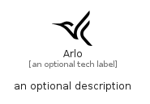

# Arlo


```text
simpleicons/A/Arlo
```

```text
include('simpleicons/A/Arlo')
```


| Illustration | Arlo |
| :---: | :---: |
|  |  |


## Sprites
The item provides the following sriptes:

- `<$ArloXs>`
- `<$ArloSm>`
- `<$ArloMd>`
- `<$ArloLg>`


## Arlo

### Load remotely
```plantuml
@startuml
' configures the library
!global $LIB_BASE_LOCATION="https://raw.githubusercontent.com/tmorin/plantuml-libs/master/distribution"

' loads the library's bootstrap
!include $LIB_BASE_LOCATION/bootstrap.puml

' loads the package bootstrap
include('simpleicons/bootstrap')

' loads the Item which embeds the element Arlo
include('simpleicons/A/Arlo')

' renders the element
Arlo('Arlo', 'Arlo', 'an optional tech label', 'an optional description')
@enduml
```

### Load locally
```plantuml
@startuml
' configures the library
!global $INCLUSION_MODE="local"
!global $LIB_BASE_LOCATION="../.."

' loads the library's bootstrap
!include $LIB_BASE_LOCATION/bootstrap.puml

' loads the package bootstrap
include('simpleicons/bootstrap')

' loads the Item which embeds the element Arlo
include('simpleicons/A/Arlo')

' renders the element
Arlo('Arlo', 'Arlo', 'an optional tech label', 'an optional description')
@enduml
```

